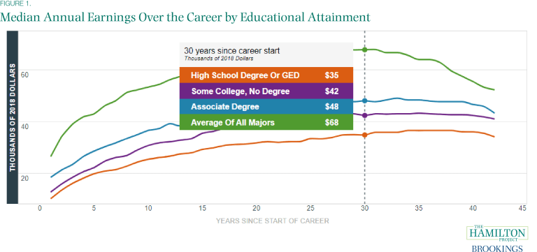

# dsc_capstone_project < TITLE TBD>


## Table of Cotents

* [Overview] (#overview)
* [Business Understanding] (#business-understanding)
* [Data Understanding] (#data-understanding)
* [Data Preparation] (#data-preparation)
* [Model Training and Testing] (#model-training-and-testing)
* [Analysis and Conclusions] (#analysis-and-conclusions)
* [Next Steps] (#next-steps)
* [Project Structure] (#project-structure)


## Overview

One of the most important and stressful decisions a high school senior and their family have to make is deciding which college or university to attend. Colleges and Universities act as  gateways to potential financial success and opportunities. [Career earnings for a bachelor's degree graduate are more than twice as high as for someone with only a high school diploma](https://www.brookings.edu/blog/up-front/2020/10/08/major-decisions-what-graduates-earn-over-their-lifetimes) While the financial prospects are a strong incentive for attending college or university, students are also taking out ever increasing loans to pay for college. [The average student loan debt for recent college graduates is more than $30,000 in 2019.](https://www.usnews.com/education/best-colleges/paying-for-college/articles/see-how-student-loan-borrowing-has-risen-in-10-years) Lastly, not all high school seniors have access to a college guidance counselor who can show them the application process and highlight institutions that they would be interested based on their goals. [Only a third of country's public high schools have a counselor devoted to helping students get prepared for college, and the problem is even worse in high-poverty schools.](https://www.edweek.org/teaching-learning/college-advising-is-in-short-supply-in-u-s-high-schools-study-finds/2018/11) all of these are factors for students to take in account and to the importance and stress in deciding which college or university to apply to.




## Business Understanding

this is the business problem....

this is how we will address the business problem....

## Data Understanding

The dataset was created by the U.S. Department of Education by matching information from the student financial aid system with federal tax returns. The dataset goes back all the way to 1998 and contains over 1,700 features. For the purpose of this project, the datatset was limited to currently operating institutions that offer predominantly associate's or bachelor's degrees from 2002 to 2012.


## Data Preparation

There are over 1,600 features in the dataset and each can be broken up into school, admissions, academics, student, cost, aid, completion, repayment, and earning categories. 

Columns were dropped if they only contained NaN values, were outdated, or were a duplicate column.

Each feature category was approached separately in order to reduce running time and to make the preprocessing more manageable, but followed the general order listed below. 

For columns with NaN values, NaN values will be replaced with the median of the institution for that column. If the column still contains Nan values, the NaN values was replaced using a KNNimputer. The KNNimputer replaces missing values by imputing the mean value from nearest neighbors found in the set. Categorical columns were dummied out.

Then the correlation for the target variable was calculated for all the features in that category. The top five strongly correlated features for each category were placed in a list that would be used to create a new dataframe with all the strongly correlated features to be used for modelling.


## Model Training and Testing

baseline model score

first simple model

model 1

model 2

model 3


## Analysis and Conclusions

model X was out best model....

here are features that improved the models...

insert graphs


## Next Steps

Now that a strong model has been established. The next step 


## Project Structure


bash 
```

```