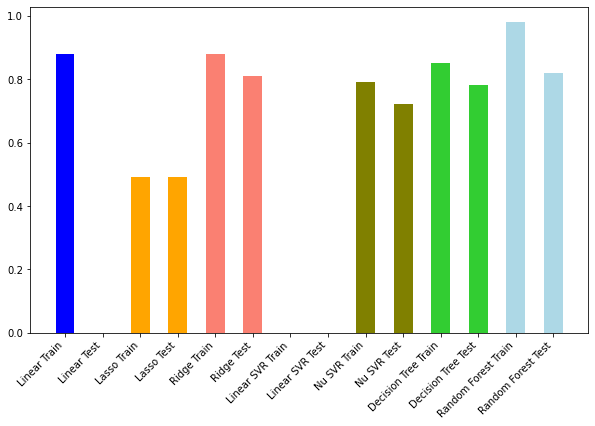

# College & University Graduation Rates


## Table of Cotents

* [Overview](#overview)
* [Business Understanding](#business-understanding)
* [Data Understanding](#data-understanding)
* [Data Preparation](#data-preparation)
* [Model Training and Testing](#model-training-and-testing)
* [Analysis and Conclusions](#analysis-and-conclusions)
* [Next Steps](#next-steps)
* [Project Structure](#project-structure)


## Overview

One of the most important and stressful decisions a high school senior and their family have to make is deciding which college or university to attend. Colleges and Universities act as  gateways to potential financial success and opportunities. [Career earnings for a bachelor's degree graduate are more than twice as high as for someone with only a high school diploma.](https://www.brookings.edu/blog/up-front/2020/10/08/major-decisions-what-graduates-earn-over-their-lifetimes) While the financial prospects are a strong incentive for attending college or university, students are also taking out ever increasing loans to pay for college. [The average student loan debt for recent college graduates is more than $30,000 in 2019.](https://www.usnews.com/education/best-colleges/paying-for-college/articles/see-how-student-loan-borrowing-has-risen-in-10-years) Lastly, not all high school seniors have access to a college guidance counselor who can show them the application process and highlight institutions that offer scholarships, grants, or financial aids. [Only a third of country's public high schools have a counselor devoted to helping students get prepared for college, and the problem is even worse in high-poverty schools.](https://www.edweek.org/teaching-learning/college-advising-is-in-short-supply-in-u-s-high-schools-study-finds/2018/11) All of these are factors that students have take in account.


## Business Understanding

Bottom Line, a college counselling non-profit organization, hired a data analyst consultant to see what other factors of a college or university lead to higher completion rate. Since they serve mostly first generations students, they want to encourage to look at other schools that have high completion rates.

## Data Understanding

The dataset was created by the U.S. Department of Education by matching information from the student financial aid system with federal tax returns. The dataset goes back all the way to 1998 and contains over 1,700 institutional features. For the purpose of this project, the datatset was limited to currently operating institutions that offer predominantly associate's or bachelor's degrees from 2002 to 2012. The dataset is from [kaggle.](https://www.kaggle.com/kaggle/college-scorecard).


## Data Preparation

There are over 1,700 features in the dataset and each can be broken up into school, admissions, academics, student, cost, aid, completion, repayment, and earning categories. 

Columns were dropped if they only contained NaN values, were outdated, or were a duplicate column.

Each feature category was approached separately in order to reduce running time and to make the preprocessing more manageable, but followed the general order of operations listed below. 

For columns with NaN values, the NaN values will be replaced with the median of the institution for that column. If the column still contains Nan values, the NaN values were replaced using a KNNimputer. The KNNimputer replaces missing values by imputing the mean value from nearest neighbors found in the set. Categorical columns were dummied out.

Then the correlation for the target variable was calculated for all the features in that category. The top five strongly correlated features for each category were placed in a list that would be used to create a new dataframe with all the strongly correlated features to be used for modelling. An additional dataframe was created using the top 30 correlated features in order to compare model performance.

## Model Training and Testing

Three models were used to determine if the top 5 features from each category dataframe or the top 25 overall features dataframe would perform better. The Top 5 features from each category performed better so three more additional models were used to see which one would have a better performance.

<ol start="0">
  <li> Dummy Regressor Model</li>
  <li>Linear Regression</li>
  <li>Lasso Regressions</li>
  <li>Ridge Regressions</li>
  <li>Linear Support Vector Regression</li>
  <li>Nu Support Vector Regression</li>
  <li>Decision Tree Regressor</li>
  <li>Random Forest Regressor</li>
</ol>

The baseline model, the Dummy Regressor, produces a terrible score of 0.004003885233955451.
The performance of the following models are highlighted in the chart below.




## Analysis and Conclusions

The Ridge Regression Model performed the best with a train and test score of 88% and 81%, respectively. Other models were, for the most part, able to not overfit to the train dataset, but not perform as well. 

This model was able to explain 81% of the variance within in the data. This is due to the complexity of the dataset and more data will be needed to improve the model's performance.

The complexity is highlighted when looking at the top two correlate features: Out of State tuition and fees and Average Cost of Attendance. The graphs show that for the most part, there is a positive trend between the two variables. However, Gibbs College and Landmark College are outliers and it is because Gibbs College eventually closed due to academic performance and complaince issues and Landmark College is a college exclusively for those with diagnosed learning disabilities, attention disorders, or autism.


## Further Analysis & Implementation

Further analysis could be made by using more recent data from the U.S. college scorecard  after 2013 to see if the model could be improved on. With more data available, the model could also be narrowed to looking at institutions that predominantly grant bachelor's degrees only. Finally, this project could be expanded to see how this model works with international institutions. 

Students and their parents often feel that they must choose the most prestigious college possible, but hopefully this project could add to the growing number of studies that show that you don't need to enroll in a big name college to not only graduate in four years but , more importantly, be successful in life. In addition, this project highlights that here are other institutional metrics that lead to a strong completion rate which can be used by high school college counselors.


## Project Structure

```
├── Data
│   ├── CollegeScorecardDataDictionary-09-12-2015.csv
│   ├── CollegeScorecardDataDictionary-09-12-2015.pdf
│   ├── database.sqlite
│   ├── instnm_df.pkl
│   ├── processed_top25_overall_df.pkl
│   ├── processed_top5_feature_df.pkl
│   └── Scorecard.csv
├── Images
│   ├── cover_image.jpg
│   ├── model_perf_graph.PNG
│   ├── money_earned_graph.png
│   ├── student_debt_graph.png
│   ├── top_attendance_graph.png
│   └── top_tuition_graph.png
├── 01_Preprocessing.ipynb
├── 02_Modelling.ipynb
├── 03_Visualizations.ipynb
├── capstone_project_presentation.pdf
└── README.md
```
